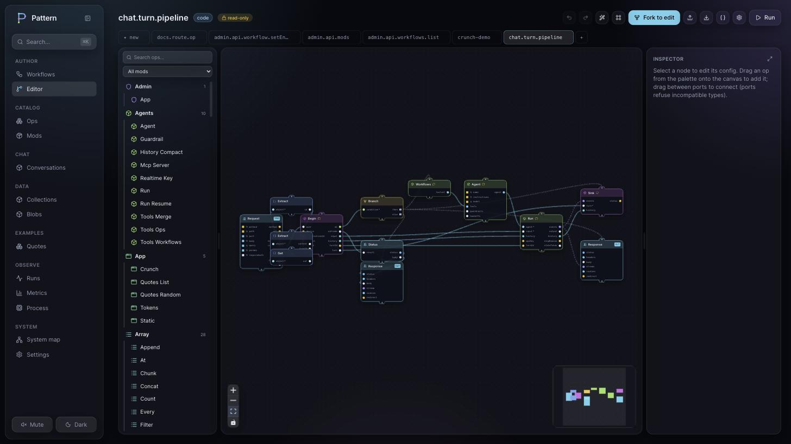
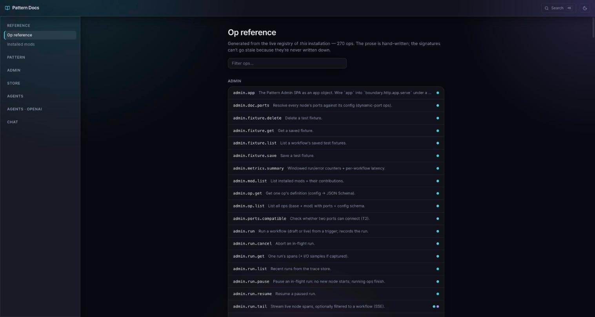

<p align="center">
  
</p>

<h1 align="center">Pattern</h1>

<p align="center">
  <b>Build backends as typed graphs of operations.</b><br/>
  Author them in JSON or a visual editor, run them with streaming and concurrency,
  and serve them as HTTP APIs, AI agents, and full apps.
</p>

<p align="center">
  <a href="https://pattern-js.dev"><b>pattern-js.dev</b></a> &nbsp;·&nbsp;
  <a href="#quick-start">Quick start</a> &nbsp;·&nbsp;
  <a href="#the-idea">The idea</a> &nbsp;·&nbsp;
  <a href="#what-you-get">What you get</a> &nbsp;·&nbsp;
  <a href="#the-ecosystem">Ecosystem</a> &nbsp;·&nbsp;
  <a href="#docs">Docs</a>
</p>

---

A **workflow** is a JSON document describing a directed graph of typed
**operations** (ops) wired together by their **ports**. The engine runs the graph
and produces a result. You can write that document by hand, generate it, or draw
it in the visual editor. They are all the same document.

<p align="center">
  
</p>

## The idea

Two pieces, and the way they connect.

- **Ops carry the code.** An op is a small typed function with named input and
  output ports: `core.string.template`, `core.http.fetch`, `agents.run`. The base
  catalog ships around 270 of them, and you add your own.
- **Workflows wire ops together.** You connect an output port to an input port,
  and the *kind* of the port decides how data moves:
  - **value** ports resolve once and the consumer waits for them (a barrier),
  - **stream** ports flow together with backpressure,
  - **control** ports fire a dataless pulse, so you can order side effects.

The schedule comes from the wiring, so there is no orchestration glue to write.
And because the whole thing is one JSON document, versioning, diffs, a visual
editor, live deploy, and run replay all come from the format itself.

## Quick start

```bash
npm create pattern@latest        # scaffold a project
cd my-app && npm install
npm run dev                      # then open http://localhost:3000/admin
```

Pick the **studio** pack and you land in a visual workspace with example
workflows you can edit, run, and trace. Or go straight to code: drop a `.json`
workflow into `workflows/` and the dev server picks it up on save.

```jsonc
// workflows/hello.json  ·  GET /hello/:name
{
  "id": "hello",
  "nodes": [
    { "id": "in",  "op": "boundary.http.request",  "config": { "method": "GET", "path": "/hello/:name" } },
    { "id": "msg", "op": "core.string.template",    "config": { "template": "Hello, {{ name }}!" } },
    { "id": "out", "op": "boundary.http.response" }
  ],
  "edges": [
    { "from": { "node": "in",  "port": "params" }, "to": { "node": "msg", "port": "data" } },
    { "from": { "node": "msg", "port": "out" },    "to": { "node": "out", "port": "body" } }
  ]
}
```

```bash
curl localhost:3000/hello/world      # Hello, world!
```

The route lives in the trigger's config, so the host derives it by scanning your
workflows. Add a file, get a route.

## What you get

**A visual control plane.** `@pattern-js/mod-admin` is the editor above, plus live
deploy with route-conflict checks, run inspection with per-node waterfalls and
replay over the graph, versioning with diffs and one-click rollback, and a
catalog of every op, mod, and workflow in your system. It is a mod itself, built
from the same primitives you author with, so its own API shows up in its catalog.

**Documentation that stays current.** `@pattern-js/mod-docs` serves a handbook plus
an op reference generated from your live installation, so the signatures are
always in sync with what is running. A `/docs/llms.txt` endpoint hands the whole
thing to a coding agent as one file.

<p align="center">
  
</p>

**Agents and apps, expressed as workflows.** A tool is a workflow. A chat turn is
a workflow you can fork in the admin. You can serve a built single-page app from a
workflow, and host many branded copies of it over a single backend.

<p align="center">
  
</p>

**A DX built for people and for agents.** Hot reload on every save, typed
connection assist in the editor, located validation errors, a `pattern ops`
catalog in the terminal, and an `AGENTS.md` in every scaffold so a coding agent is
productive on its first try.

## The ecosystem

Everything beyond the engine is an optional mod you `engine.use()`.

| Package | Role |
|---|---|
| [`@pattern-js/core`](packages/core) | the runtime-neutral engine: types, validation, scheduler, streams, the base op catalog, boundaries, hooks, auth, observability |
| [`@pattern-js/runtime-node`](packages/runtime-node) | the Node adapter: HTTP / WebSocket / CLI / schedule hosts, a worker pool, trace stores, the `pattern` CLI |
| [`@pattern-js/mod-admin`](packages/mod-admin) · [`@pattern-js/admin-sdk`](packages/admin-sdk) | the visual control plane and its extension surface |
| [`@pattern-js/mod-docs`](packages/mod-docs) | the served handbook and the generated op reference |
| [`@pattern-js/mod-identity`](packages/mod-identity) · [`@pattern-js/mod-auth-magic-link`](packages/mod-auth-magic-link) | users, sessions, roles, magic-link login |
| [`@pattern-js/mod-store`](packages/mod-store) · [`@pattern-js/mod-vault`](packages/mod-vault) | document / blob / lease persistence and encrypted secrets |
| [`@pattern-js/mod-agents`](packages/mod-agents) · [`@pattern-js/mod-ai`](packages/mod-ai) | the neutral agent contracts + native run loop, and the AI capability layer (model provider, text / image / embeddings / STT / TTS / video, MCP) |
| [`@pattern-js/mod-chat`](packages/mod-chat) | a complete chat application |
| [`create-pattern`](packages/create-pattern) | the scaffolder (`npm create pattern`) |

Building your own? `npm create pattern -- --kind mod` scaffolds a publishable mod
with an example op, a route, an admin page, a docs chapter, and a test.

## Docs

The full handbook is online at [pattern-js.dev](https://pattern-js.dev). It is also
served at `/docs` in any project that installs `@pattern-js/mod-docs`, and ships as
markdown inside [the package](packages/mod-docs/docs).

- [Getting started](packages/mod-docs/docs/getting-started.md)
- [Concepts](packages/mod-docs/docs/concepts.md) and [Architecture](packages/mod-docs/docs/architecture.md)
- Author a workflow [in the admin](packages/mod-docs/docs/guides/workflow-in-the-admin.md) or [in JSON](packages/mod-docs/docs/guides/workflow-in-json.md)
- [Authoring ops](packages/mod-docs/docs/guides/authoring-ops.md), [serving a frontend app](packages/mod-docs/docs/guides/frontend-app-with-workflows.md), and [building a mod](packages/mod-docs/docs/guides/creating-a-mod.md)

## CLI

```bash
pattern ops [query]            # browse every op, your mods included
pattern graph workflow.json    # print a workflow as a terminal graph
pattern validate file.json     # validate, with located, readable errors
pattern dev [entry]            # run with file-watch hot reload
pattern run file.json|id       # run a CLI workflow once
```

## Develop

```bash
pnpm install
pnpm build
pnpm test          # scheduler, streams, boundaries, hooks, auth, workers, admin, SPA
pnpm typecheck
```

## License

[MIT](LICENSE)
